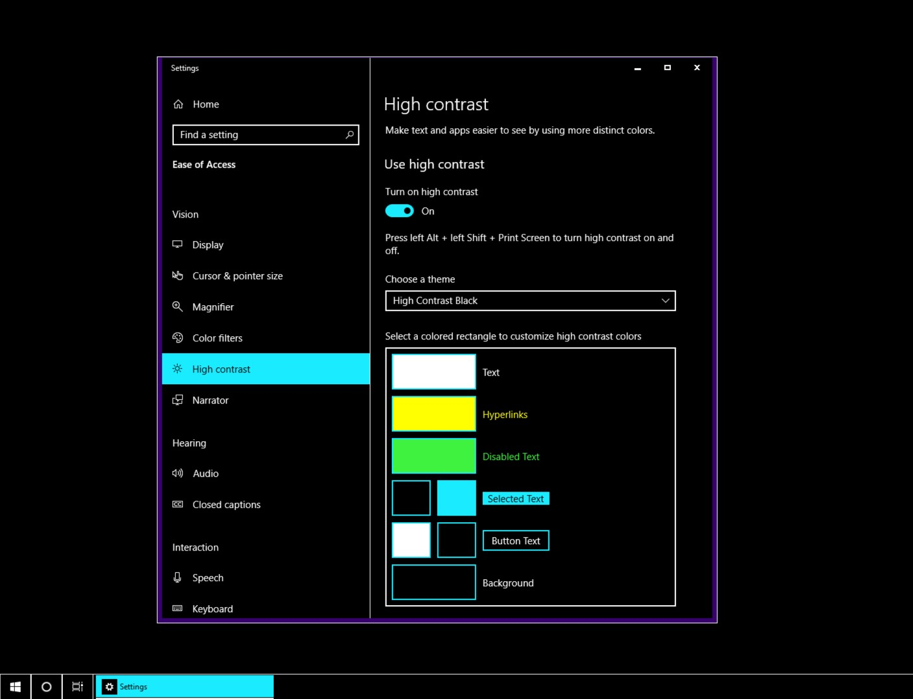
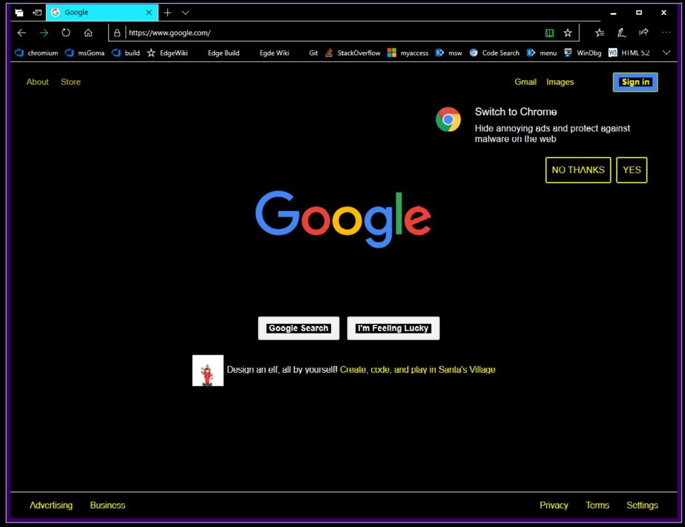
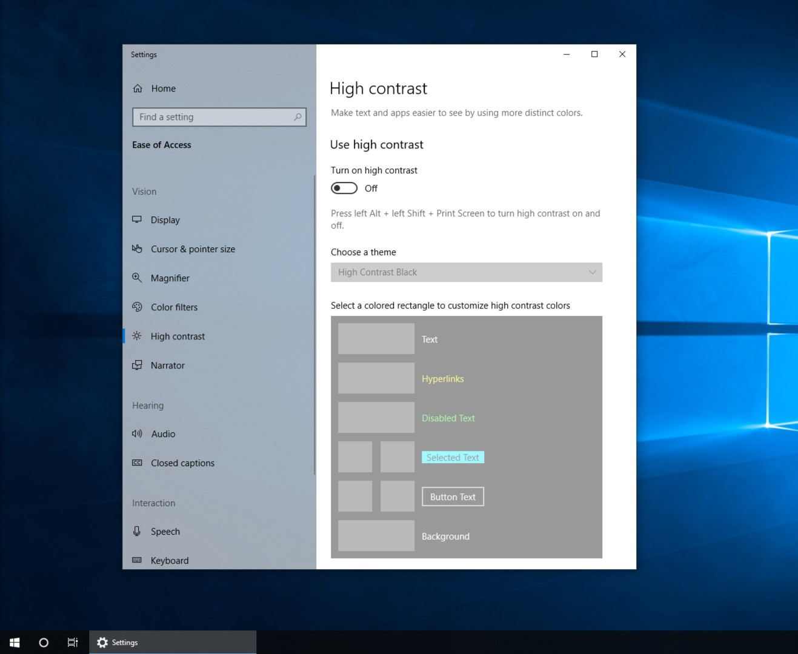
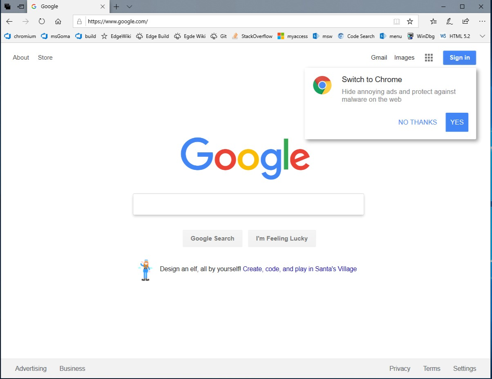
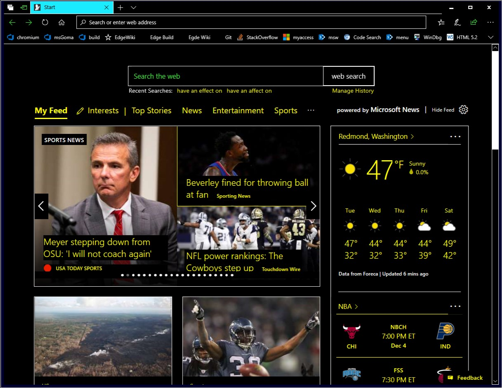

# High Contrast Explained

## Overview

High contrast is a [Windows based accessibility feature](https://docs.microsoft.com/en-us/windows/desktop/w8cookbook/high-contrast-mode) that increases the readability of text through color contrast. Individuals with low vision may find it difficult to read text on their screen due to poor contrast between foreground and background colors. High contrast is a useful feature in increasing the readability of screen-based text for these individuals.

Windows currently supports built-in [high contrast color themes](https://docs.microsoft.com/en-us/windows/uwp/design/accessibility/high-contrast-themes) such as the more popular "black-on-white" and "white-on-black" themes, as well as the ability for users to customize their own themes. These color schemes are propagated into website styles to provide increased readability, allowing a seamless experience across the Windows OS and various applications when high contrast is enabled.

Edge is currently the only browser to support the high contrast feature using Windows high contrast themes. When high contrast is enabled, Chrome will display a popup prompt to install the [High Contrast extension](https://chrome.google.com/webstore/detail/high-contrast/djcfdncoelnlbldjfhinnjlhdjlikmph). This extension uses CSS/SVG filter effects overlaid on the entire webpage and uses its own predefined themes. This does not enable a seamless experience for users when in high contrast.

## User Flow

1. User enables high contrast on their Windows device.

2. User opens the Chrome browser and the chosen high contrast theme ("white-on-black" in this case) is used throughout their entire browsing experience.

3. User turns high contrast off.

4. The opened browser is dynamically updated to use the original site-defined colors.


## CSS Media Query

In order to allow developer defined high contrast rules for webpages, a [high contrast media query type](https://msdn.microsoft.com/en-us/library/hh771830(v=vs.85).aspx) would be added called ```-ms-high-contrast-adjust```. This CSS media query type is currently supported by Edge. If an ```-ms-high-contrast-adjust``` media query evaluates to true, any styles defined within that media query *will* be used when in high contrast and will *not* be overridden by the high contrast feature.

#### Possible values

Value | Description
--- | --- 
**active** | The subsequent style rules will be applied when high contrast is enabled under any theme, custom or not.
**black-on-white** | The subsequent style rules will be applied when high contrast is enabled under the black-on-white color theme.
**white-on-black** | The subsequent style rules will be applied when high contrast is enabled under the white-on-black color theme.

#### Example usage

```html
<style>
    @media (-ms-high-contrast: active) {
        p { color: red; }
    }
    @media (-ms-high-contrast: black-on-white) {
        p { color: blue; }
    }
    @media (-ms-high-contrast: white-on-black) {
        p { color: green; }
    }
    body {
        color: orange;
    }
</style>
<body>
    <p>Some Text</p>
<body>
```
In the HTML code snippet above, ```"Some Text"``` will appear orange when high contrast is disabled and blue when high contrast is enabled **only** under the "black-on-white" high contrast color scheme. ```"Some Text"``` will appear green when high contrast is enabled **only** under the "white-on-black" high contrast color scheme. In any other high contrast color scheme (for example, under a custom high contrast theme), ```"Some Text"``` will appear red.


## CSS Properties

To allow further developer customization of the high contrast feature, a [CSS property](https://msdn.microsoft.com/en-us/library/hh771863(v=vs.85).aspx), ```-ms-high-contrast-adjust```, would be added. This CSS property type is currently supported by Edge. This property can be used to override the effects of high contrast.

#### Possible values

Value | Description
--- | --- 
**auto** | Indicates that the applicable CSS styles *will* be overridden when high contrast is enabled.
**none** | Indicates that the applicable CSS styles will *not* be overridden when high contrast is enabled.

#### Example usage

```html
<style>
    body {
        -ms-high-contrast-adjust: none;
        color: orange;
    }
</style>
<body>
    <p>Some Text</p>
<body>
```
In the HTML code snippet above, ```"Some Text"``` will appear orange whether or not high contrast is enabled because ```-ms-high-contrast-adjust``` is set to ```none```, effectively preventing high contrast from affecting its color.

## System Colors
High contrast relies on system color keywords, which are deprecated from the CSS Color standard in both [Level 3](https://drafts.csswg.org/css-color-3/#css2-system) and [Level 4](https://drafts.csswg.org/css-color-4/#system-colors). Blink currently does have support for these keywords, but they're currently mapped to hard-coded values instead of being plumbed through to the system color API. There is a derived class ```LayoutThemeWin```, but it currently doesn't add any functionality. Functionality can be added here to support the required system color keywords.

In addition to existing CSS system color keywords, an additional system color keyword will need to be added called ```-ms-hotlight``` that defines the system color for hyperlinks. This system color keyword is currently supported by Edge.

#### Example usage

```html
<style>
    a:link {
        color: -ms-hotlight;
    }
</style>
```

## Ensuring Readability
The goal of high contrast is to ensure a certain level of contrast between foreground and background colors. A problem arises with images. If text lies atop an image, altering the color of the text will not ensure readability. One option would be to override images to allow text readability. This solution, however, is not an ideal one, as it can completely change the context of a webpage for users using high contrast.

Instead of completely removing images altogther, a preferred solution is to draw a so-called "readability backplate" behind all text to ensure contrast for text lying above images, as seen in the screenshot below. This solution is currently used in Edge to ensure the readability of text in high contrast.



## Open questions

Should the high contrast readability backplate be customizable for developers? In other words, should there be a similar ```-ms-high-contrast-backplate``` CSS property be added to allow certain styles of the backplate to be customized?
* Properties that could apply: ```padding```, ```border-radius```, ```opacity```.
